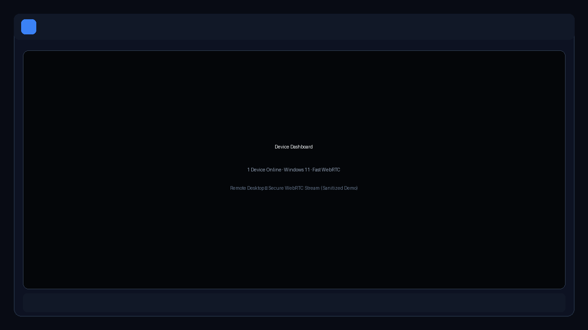
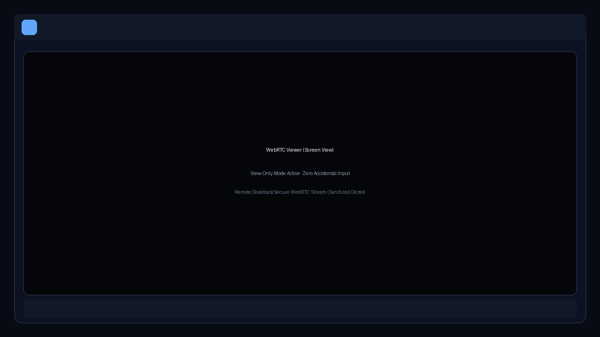
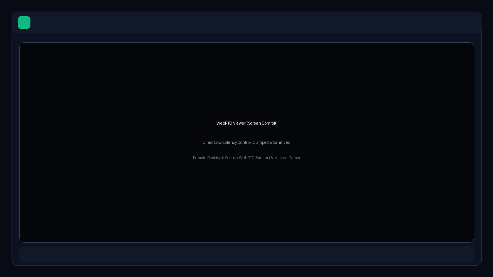
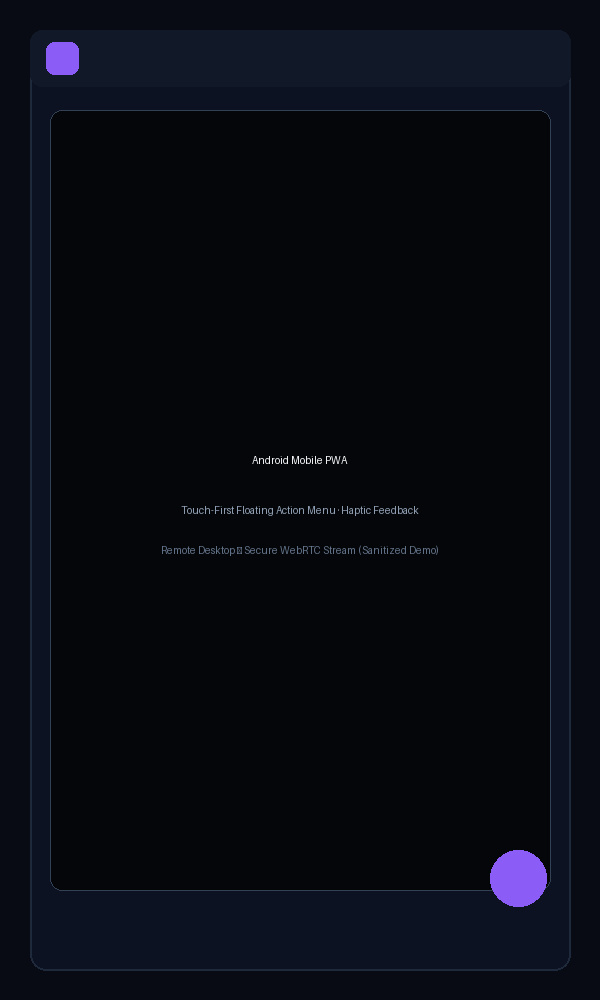

# Remote Desktop

> A self-hosted, security-focused remote desktop platform built with FastAPI, WebRTC, WebSockets, and a touch-friendly Progressive Web App interface.

[](https://www.python.org/)
[](https://fastapi.tiangolo.com/)
[](https://aiortc.readthedocs.io/)
[](LICENSE)

> **Status:** Personal-use project / active development  
> **Security note:** Designed for trusted, authenticated users. For remote access, use a private VPN such as Tailscale or WireGuard. Do not expose the development server directly to the public internet.



## Features

### Remote Desktop Experience
- **Real-time Streaming:** Low-latency 30 FPS desktop streaming powered by WebRTC (`aiortc` + PyAV).
- **Screen View by Default:** Safe view-only mode on every launch to prevent accidental input injection.
- **Explicit Screen Control:** Server-side verified control mode for mouse, keyboard, and shortcut handling.
- **Dynamic Resolution Profiles:** `720p` (Recommended baseline), `Balanced` (1280×800), `High` (1920×1200), `Low` (854×480), `Native`, `Auto`, and custom resolutions.
- **Aspect Ratio & Fit Modes:** `Fit` (letterbox with exact aspect preservation), `Fill` (stretch to fill canvas), and `1:1` (native unscaled pixels).
- **Multi-Monitor Support:** Dynamic monitor discovery and 1-click display switching.
- **Live Telemetry HUD:** Real-time metrics for FPS, RTT latency, incoming bitrate, active resolution, and encoder pipeline.

### Mobile & PWA
- **Progressive Web App (PWA):** Installable on Android / iOS directly from Chrome / Safari.
- **Mobile Floating Action Button (FAB):** Quick access to clipboard sync, keyboard toggle, fullscreen, reconnect, and power controls.
- **Bidirectional Clipboard Sync:** Seamlessly copy remote PC clipboard to mobile, or push mobile text to PC.
- **Haptic Feedback:** Native touch feedback for control interactions on supported devices.
- **Quick Reconnect:** Smooth session recovery during network transitions (Wi-Fi $\leftrightarrow$ Cellular $\leftrightarrow$ VPN).

### Device Management & Power Actions
- **Device Health & Dashboard:** Real-time host device information, OS telemetry, and network status.
- **Safe Power Actions:** 1-tap `Lock` workstation, plus confirmation-guarded `Sleep`, `Restart`, `Hibernate`, and `Shutdown`.
- **REST Heartbeat Validation:** Power actions actively verify host reachability before dispatching OS-level commands.

### Hardened Security Architecture
- **JWT & Rotating Refresh Tokens:** 15-minute access tokens paired with HttpOnly, Secure, SameSite refresh cookies.
- **Token Theft Detection:** Automatic revocation of all user sessions upon detection of revoked token reuse.
- **Single-Use WebSocket Tickets:** Short-lived (60s), single-use authorization tickets with origin validation.
- **Input Sanitization & Clamping:** Server-side keyboard sanitizer blocks dangerous system shortcuts (e.g., `Win+R`, `Ctrl+Alt+Del`); mouse coordinates are strictly clamped.
- **Enterprise Audit Logging:** Comprehensive security event logging without recording passwords, tokens, or clipboard contents.
- **Strict Security Headers:** Out-of-the-box CSP, HSTS, X-Frame-Options (`DENY`), and Permissions-Policy headers.

---

## Screenshots

| Dashboard | Viewer — Screen View |
|---|---|
|  |  |

| Viewer — Screen Control | Android PWA |
|---|---|
|  |  |

---

## Architecture

```text
Browser / Android PWA
        │
        ├── HTTPS REST API ─────── Authentication, devices, files, sessions, power
        ├── WSS Control Channel ── Mouse, keyboard, clipboard, state transitions
        └── WebRTC Stream ──────── Real-time video frames (aiortc / PyAV)

FastAPI Backend
├── app/core/       Configuration, SQLite database, security & crypto utilities
├── app/models/     SQLAlchemy models (Users, Sessions, WS Tickets, Audit Events)
├── app/routers/    Auth, stream, control, files, monitors, power, audit APIs
├── app/services/   Threaded screen capture (MSS), input injection (PyAutoGUI), audio
└── tests/          36/36 automated security and functional regression tests
```

---

## Tech Stack

| Area | Technologies |
|---|---|
| **Backend** | Python 3.10+, FastAPI, Uvicorn |
| **Streaming** | WebRTC (`aiortc`), PyAV |
| **Capture & Input** | MSS, OpenCV, PyAutoGUI |
| **Database & Auth** | SQLite, SQLAlchemy, Passlib (bcrypt), PyJWT |
| **Frontend** | Vanilla HTML5, Modern CSS Glassmorphism, Vanilla JS, WebRTC API |
| **Mobile** | Web App Manifest (PWA), Service Worker ready, Touch Events API |
| **Deployment** | Caddy Reverse Proxy, Docker Compose |
| **Secure Networking** | Tailscale / WireGuard |

---

## Quick Start

### Prerequisites
- Python 3.10 or newer
- Windows host recommended for interactive desktop input and power management
- Modern web browser (Google Chrome, Microsoft Edge, Mozilla Firefox, Safari)

### Installation

1. **Clone the repository:**
   ```bash
   git clone https://github.com/YOUR_GITHUB_USERNAME/remote-desktop.git
   cd remote-desktop
   ```

2. **Create and activate virtual environment:**
   ```bash
   python -m venv venv
   # Windows PowerShell:
   .\venv\Scripts\Activate.ps1
   # Linux / macOS:
   source venv/bin/activate
   ```

3. **Install dependencies:**
   ```bash
   pip install -r requirements.txt
   ```

4. **Configure environment:**
   ```bash
   copy .env.example .env
   ```
   Generate a cryptographic secret key:
   ```bash
   python -c "import secrets; print(secrets.token_hex(32))"
   ```
   Paste the generated string into `.env` as `SECRET_KEY`.

5. **Start the server:**
   ```bash
   python server.py
   # Or directly with uvicorn:
   python -m uvicorn app.main:app --host 0.0.0.0 --port 9005 --reload
   ```

6. **Create the initial admin account:**

   Before first login, set `INITIAL_ADMIN_PASSWORD` in your `.env` file:

   ```env
   INITIAL_ADMIN_PASSWORD=YourStrongPassword123!
   ```

   On first startup, the application will create the `admin` account using this password.
   Once any admin exists in the database, this setting is ignored.
   Use a strong password of at least 12 characters — weak or common values are rejected.

   > **Security:** Never commit your `.env` file. After first login, rotate this password
   > and consider removing `INITIAL_ADMIN_PASSWORD` from your environment.

6. **Access the application:**
   - **Local Web:** [http://localhost:9005](http://localhost:9005)

---

## Configuration

Key settings in `.env`:

| Variable | Default | Purpose |
|---|---|---|
| `APP_ENV` | `development` | `development` or `production` (enforces strict safety checks) |
| `SECRET_KEY` | *(Required)* | 32+ character secret for signing JWTs |
| `PUBLIC_ORIGIN` | `""` | Public HTTPS origin (e.g. `https://rd.yourdomain.com`) |
| `ALLOWED_ORIGINS` | `http://localhost:9005` | Comma-separated list of allowed CORS origins |
| `ALLOWED_WS_ORIGINS` | `http://localhost:9005` | Comma-separated list of allowed WebSocket origins |
| `COOKIE_SECURE` | `false` | Must be `true` in production with HTTPS |
| `INITIAL_ADMIN_PASSWORD` | *(not set)* | One-time password to seed the first admin account (ignored once an admin exists) |
| `CAPTURE_FPS` | `30` | Target streaming frame rate |
| `DEFAULT_WIDTH` | `1280` | Default stream capture width |
| `DEFAULT_HEIGHT` | `720` | Default stream capture height |

---

## Testing

Run the automated test suite covering authentication, refresh-token rotation, WebSocket single-use tickets, rate limiting, and security sanitizers:

```bash
python -m pytest tests/ -v
```

---

## Deployment

For personal remote access:
1. Connect host PC and mobile devices to a private mesh network (e.g. [Tailscale](https://tailscale.com/)).
2. Use **Caddy** as a reverse proxy for automatic HTTPS/WSS TLS termination.
3. Keep the FastAPI backend bound to `127.0.0.1` behind the proxy.

Detailed production and proxy configuration instructions are available in [docs/ONLINE_DEPLOYMENT.md](docs/ONLINE_DEPLOYMENT.md).

---

## Documentation

- [System Architecture & Data Flows](docs/ARCHITECTURE.md)
- [Security Model & Hardening Guide](docs/SECURITY.md)
- [Online & VPN Deployment Guide](docs/ONLINE_DEPLOYMENT.md)
- [Mobile PWA & Touch Guide](docs/MOBILE_PWA.md)

---

## Responsible Use

This software is intended for personal remote desktop management and authorized system administration on devices and networks you own or have explicit permission to access.

## License

This project is licensed under the [MIT License](LICENSE).
